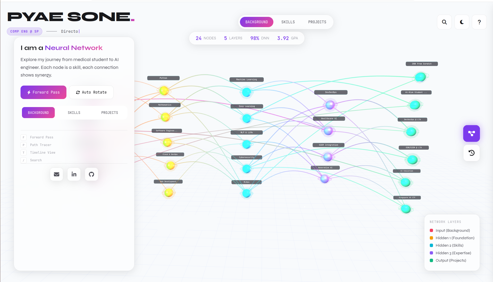

# Neural Network Portfolio

An interactive 3D portfolio that visualizes skills, experiences, and projects as a neural network. Built with Three.js, this mobile-first web experience represents a unique journey from medical student to AI/ML engineer.

[](https://pyaesonep.github.io/neural-network-portfolio)
[](LICENSE)
[](/)



## Features

### Core Experience
- **Interactive 3D Neural Network** - Navigate through skills represented as glowing nodes
- **Real-time Data Flow** - Watch "forward pass" animations showing skill connections
- **Deep Linking** - Share direct links to specific nodes
- **Dark/Light Mode** - Automatic theme detection with manual toggle

### Discovery Tools
- **Skill Path Tracer** - Find the shortest path between any two skills using BFS algorithm
- **Smart Search** - Filter nodes by name, tags, or description
- **Timeline View** - See career progression chronologically (2015-2026)
- **Activation Visualization** - View proficiency levels for each skill

### Mobile-First Design
- **Bottom Sheet Navigation** - Native app-like interface on mobile
- **Touch Optimized** - Drag to rotate, pinch to zoom, tap to select
- **Performance Optimized** - Reduced particles and geometry on mobile devices
- **Safe Area Support** - Full compatibility with notched phones

### Onboarding
- **Interactive Tour** - 4-step guided introduction for first-time visitors
- **Element Highlighting** - Spotlights key UI features during onboarding
- **Persistent Memory** - Remembers returning visitors

## 🛠️ Tech Stack

- **Three.js** - 3D rendering and WebGL
- **Vanilla JavaScript** - No framework dependencies
- **CSS3** - Mobile-first responsive design with CSS custom properties
- **Font Awesome** - Icons
- **Google Fonts** - Syne + JetBrains Mono typography

## Quick Start

### Option 1: Direct Use
Simply download `nn-portfolio-v4-mobile-first.html` and open it in any modern browser.

### Option 2: Local Development
```bash
# Clone the repository
git clone https://github.com/yourusername/neural-network-portfolio.git

# Navigate to directory
cd neural-network-portfolio

# Open in browser (or use any local server)
open nn-portfolio-v4-mobile-first.html

# Or serve with Python
python -m http.server 8000
```

### Option 3: Deploy
Upload to any static hosting service:
- Vercel
- Netlify
- GitHub Pages
- Cloudflare Pages

##  Keyboard Shortcuts

| Key | Action |
|-----|--------|
| `F` | Trigger Forward Pass animation |
| `A` | Show Activation levels |
| `R` | Reset camera view |
| `P` | Open Path Tracer |
| `T` | Toggle Timeline/Network view |
| `D` | Toggle Dark/Light mode |
| `L` | Toggle node labels (desktop) |
| `/` | Open search |
| `Esc` | Close panels/overlays |

## Responsive Breakpoints

| Breakpoint | Layout |
|------------|--------|
| < 768px | Mobile - Bottom sheet, FABs, full-screen overlays |
| 768px - 1023px | Tablet - Side panel, tooltips, expanded controls |
| ≥ 1024px | Desktop - Sidebar, legend, timeline bar, keyboard hints |

## Customization

### Adding/Editing Nodes
Edit the `networkData` object in the JavaScript section:

```javascript
networkData.layers[0].nodes.push({
    id: 'unique_id',
    name: 'Display Name',
    icon: 'fa-icon-name',
    description: 'Node description...',
    tags: ['Tag1', 'Tag2'],
    activation: 0.85, // 0-1 proficiency
    year: 2025 // For timeline view
});
```

### Adding Connections
```javascript
networkData.connections.push({
    from: 'source_node_id',
    to: 'target_node_id',
    strength: 0.8 // 0-1 connection weight
});
```

### Theme Colors
Modify CSS custom properties in `:root` and `[data-theme="dark"]`:

```css
:root {
    --primary: #7c3aed;
    --color-input: #f43f5e;
    --color-hidden1: #f59e0b;
    /* ... */
}
```

## Project Structure

```
neural-network-portfolio/
├── nn-portfolio-v4-mobile-first.html  # Main file (all-in-one)
├── README.md
├── LICENSE
└── preview.png                         # Screenshot for README
```

## Configuration Options

```javascript
const config = {
    layerGap: 10,           // Distance between layers
    nodeSpacing: 3.2,       // Vertical spacing between nodes
    nodeSize: 0.55,         // Base node radius
    particleCount: 1200,    // Background particles (600 on mobile)
    dataPacketSpeed: 0.018  // Animation speed for data flow
};
```

## Network Structure

The portfolio is organized into 5 neural network layers:

1. **Input Layer** - Background & Core Values (Medical, Heritage, Resilience, Excellence)
2. **Hidden Layer 1** - Foundation Skills (Python, Math, Software Eng, Cloud, Web Dev)
3. **Hidden Layer 2** - Technical Skills (ML, DL, NLP, Cybersecurity, MLOps)
4. **Hidden Layer 3** - Expertise (DevSecOps, Healthcare AI, SIEM, GenAI)
5. **Output Layer** - Projects & Achievements (DNN, Student Prediction, CTF, etc.)

## Browser Support

- ✅ Chrome 90+
- ✅ Firefox 88+
- ✅ Safari 14+
- ✅ Edge 90+
- ✅ Mobile Safari (iOS 14+)
- ✅ Chrome Mobile (Android 10+)

## Performance

| Device | FPS | Load Time |
|--------|-----|-----------|
| Desktop | 60 | < 2s |
| Tablet | 55-60 | < 2.5s |
| Mobile | 45-60 | < 3s |

*Performance optimizations include reduced geometry detail, fewer particles, and disabled effects on mobile.*

## Contributing

Contributions are welcome! Feel free to:

1. Fork the repository
2. Create a feature branch (`git checkout -b feature/amazing-feature`)
3. Commit changes (`git commit -m 'Add amazing feature'`)
4. Push to branch (`git push origin feature/amazing-feature`)
5. Open a Pull Request

## License

This project is licensed under the MIT License - see the [LICENSE](LICENSE) file for details.

## Author

**Pyae Sone**
- Computer Engineering @ Singapore Polytechnic
- Former Medical Student → AI/ML Engineer
- pyaesone.perfect2014@gmail.com
- [LinkedIn](https://www.linkedin.com/in/pyaesonep/)
- [GitHub](https://github.com/pyaesonep)

---

<p align="center">
  Made with Claude Opus by Pyae Sone
  <br>
  <sub>Inspired by the architecture of neural networks</sub>
</p>